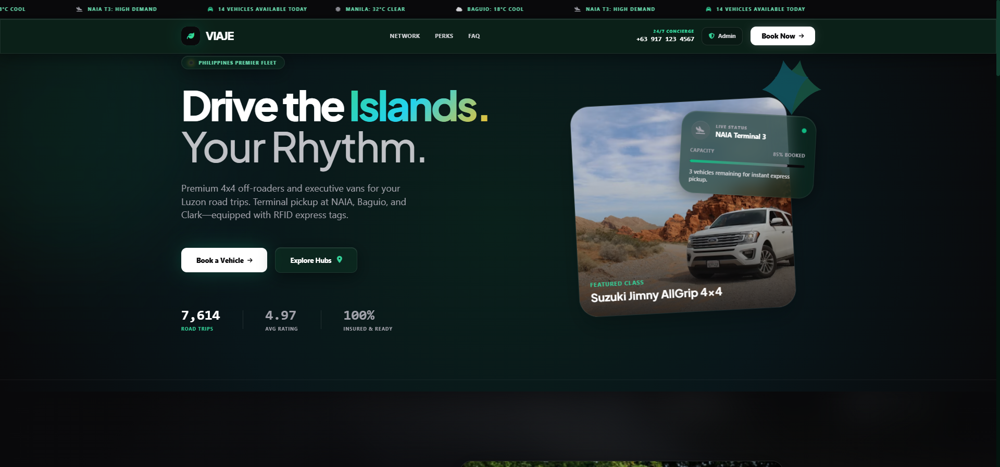
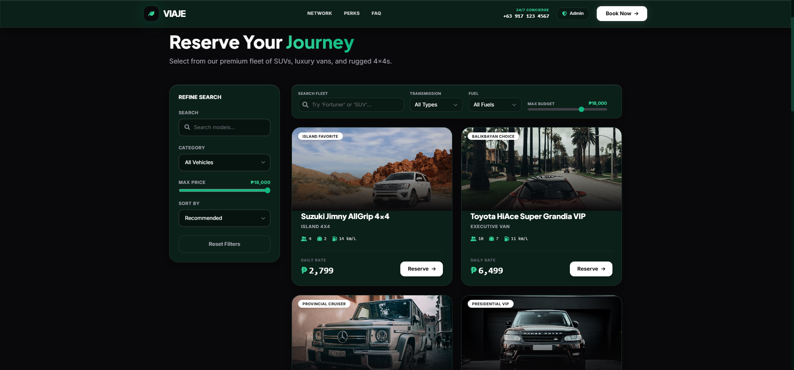
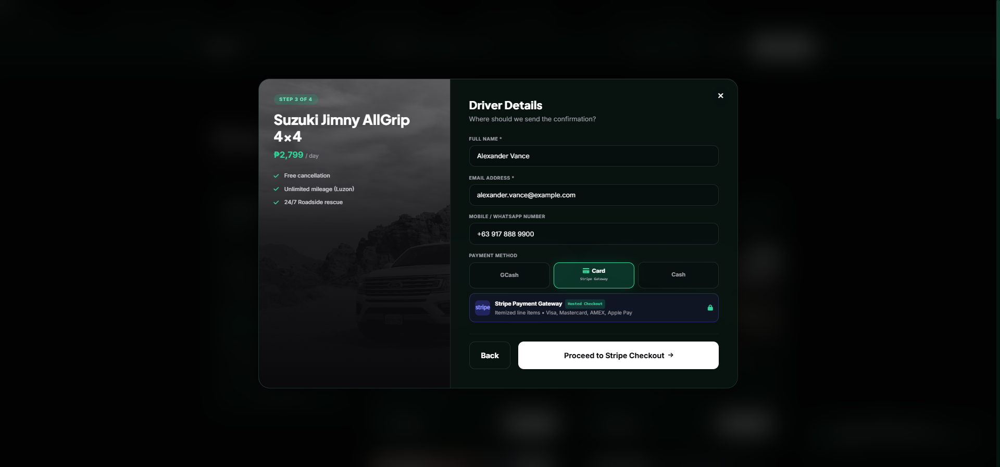
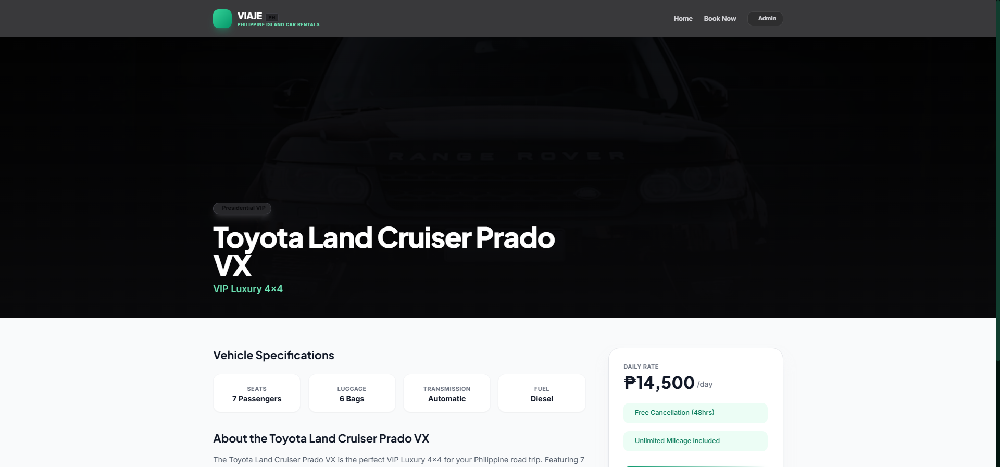

# VIAJE — Premium Car Rental & Reservation Platform

<p align="center">
  
</p>

<p align="center">
  
  
  
  
  
  
</p>

---

## 📌 Executive Overview

**VIAJE** is a full-stack, production-grade car rental and fleet reservation platform engineered for island and provincial travel in the Philippines. Built on the modern **TALL stack** (Tailwind CSS, Alpine.js, Laravel 11, Livewire v3), it delivers single-page application (SPA) responsiveness with server-side security, concurrency handling, and automated financial precision.

---

## 🛠 Key Engineering & Architecture Highlights

### 1. Concurrency & Race-Condition Prevention
- **Pessimistic Database Locking:** Employs `lockForUpdate()` inside atomic database transactions during reservation lookups and checkout dispatch.
- **Double-Booking Shield:** Eliminates overlapping calendar collisions under high-frequency concurrent user bookings.

### 2. Domain Pricing Service & Centavo Balancing
- Encapsulated calculation in [`App\Services\BookingPricingService`](app/Services/BookingPricingService.php).
- Dynamically computes multi-day duration discounts, airport terminal pickup/dropoff fees, and optional protections (Zero Liability CDW, Chauffeur, RFID toll card).
- **Penny-Exact VAT Balancing:** Ensures unit line items and statutory 12% Value Added Tax balance to the exact integer centavo required by payment gateways.

### 3. Stripe Checkout Gateway (Laravel Cashier v16)
- **Dynamic Itemized Line Items:** Vehicle rentals, add-ons, and VAT are generated dynamically via Cashier's `$booking->checkout($lineItems, ...)`, eliminating dashboard SKU maintenance.
- **Typed Enum State Transitions:** Uses [`App\Enums\BookingStatus`](app/Enums/BookingStatus.php) (`Pending`, `Confirmed`, `Paid`, `Cancelled`) for type-safe state mutations upon gateway return or webhook receipt.

### 4. Reactive Frontend Architecture
- **Interactive Multi-Step Modal:** 4-step wizard (Trip Details $\to$ Add-on Protection $\to$ Driver Details $\to$ Stripe Gateway Selection) with Alpine.js state synchronization.
- **Real-Time Fleet Filters:** Instant client-side search, transmission/fuel pills, and budget sliders without full-page reloads.
- **Glassmorphic Luxury UI:** Custom dark-mode design system with emerald accents and real-time airport demand tickers.

### 5. Automated PDF Invoicing & Mail Delivery
- Automatically generates downloadable PDF confirmation vouchers via `dompdf`.
- Dispatches queued booking alerts to customers and fleet administrators via Mailgun (`ShouldQueue`).

---

## 📸 Platform Showcase

| Feature | Preview |
| :--- | :--- |
| **Fleet Catalog & Real-time Filters** |  |
| **Stripe Checkout Integration** |  |
| **Vehicle Specification Showcase** |  |

---

## 🧪 Automated Test Suite

Full automated test suite written in **Pest PHP** verifying business logic, API endpoints, Stripe line items, and security boundaries:

```bash
php artisan test
```

```text
Tests:    29 passed (158 assertions)
Duration: 7.38s
Result:   100% Green
```

### Covered Test Domains:
- `StripeItemizedProductTest`: Exact penny balancing and line item composition.
- `BookingSecurityTest`: Input sanitization, flight number validation, and transaction rollbacks.
- `BookingTest`: Reservation lifecycle, date availability queries, and mail notifications.
- `AdminFleetTest`: Vehicle creation, status transitions, and fleet inventory management.

---

## 🚀 Local Installation & Setup

### Prerequisites
- PHP 8.3+ (Laravel Herd recommended on Windows/macOS)
- Composer 2+
- Node.js 20+ & NPM
- SQLite or MySQL 8+

### Setup Steps

1. **Clone the repository:**
   ```bash
   git clone https://github.com/matthewwilliamberces-droid/viajecarrental.git
   cd viajecarrental
   ```

2. **Install PHP and Node dependencies:**
   ```bash
   composer install
   npm install
   ```

3. **Configure environment:**
   ```bash
   cp .env.example .env
   php artisan key:generate
   ```

4. **Run migrations and database seeder:**
   ```bash
   php artisan migrate --seed
   ```

5. **Build frontend assets:**
   ```bash
   npm run build
   ```

6. **Serve the application:**
   - **Laravel Herd:** Automatically served at `http://viajecarrental.test`
   - **Artisan Serve:**
     ```bash
     php artisan serve
     ```

---

## 🔒 Security Best Practices

- **Zero Hardcoded Secrets:** All Stripe and Mailgun API credentials reside strictly in `.env`.
- **Mass-Assignment Protection:** Strict Eloquent `$fillable` guards across all models.
- **Rate Limiting:** API availability and booking dispatch throttled at the routing layer (`throttle:10,1`, `throttle:60,1`).

---

## 📄 License

This project is open-sourced software licensed under the [MIT License](LICENSE).
